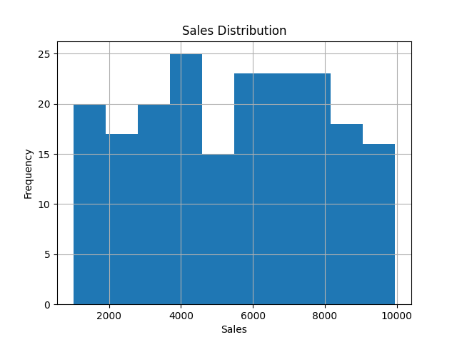
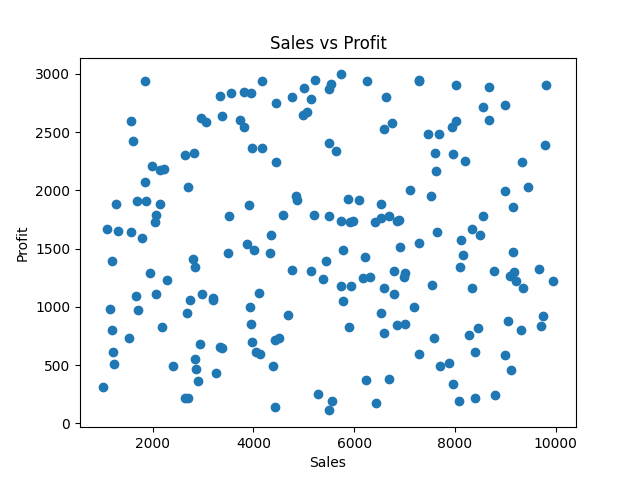
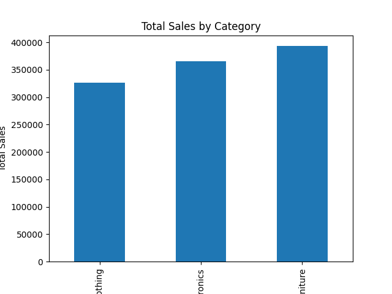
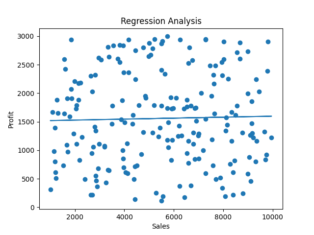

📊 Sales Data Analysis using R

📌 Objective

This project focuses on analyzing sales data using R programming. It includes data cleaning, visualization, and statistical analysis.

🛠 Tools & Technologies

* R Programming
* dplyr
* tidyr
* ggplot2

📂 Dataset

The dataset contains:

* Date
* Category (Electronics, Clothing, Furniture)
* Sales
* Profit

📈 Analysis Performed

* Data Import and Cleaning
* Descriptive Statistics (Mean, Median, SD)
* Data Visualization (Histogram, Scatter Plot, Bar Chart)
* Correlation Analysis
* Linear Regression Model
* Outlier Detection
* Data Scaling

📊 Sample Visualizations

Histogram

Scatter Plot

Bar Chart

Regression Plot

🚀 How to Run

1. Open RStudio
2. Load the dataset (`sales_data.csv`)
3. Run `sales_analysis.R`

📎 Conclusion

This project demonstrates how R can be used for data analysis, visualization, and basic predictive modeling.
